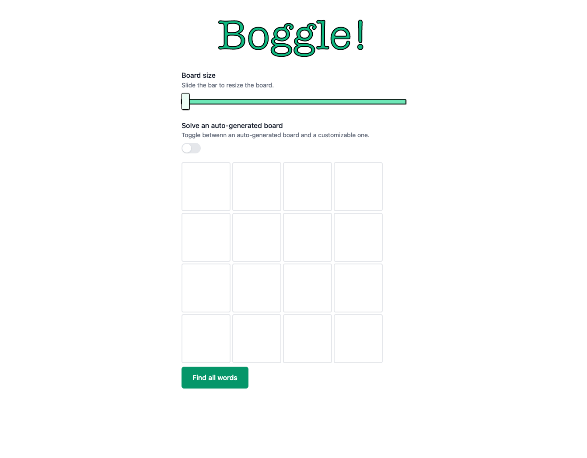
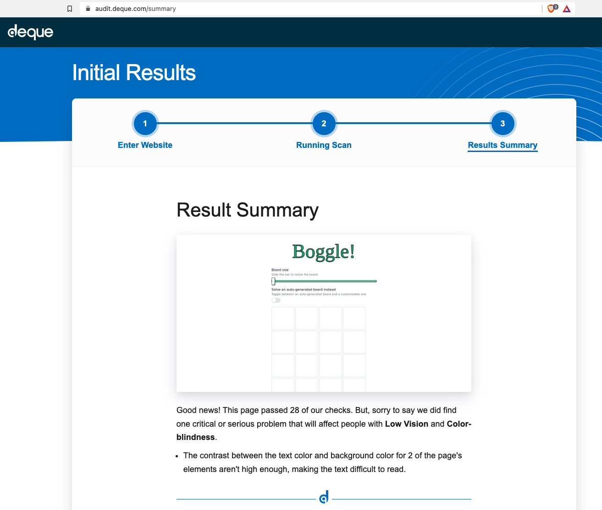

# Boggle!



## Features

- Create and solve your own Boggle board, or let the app generate and solve one for you.
- Resize the playable grid to any of the following:
  - 4 x 4
  - 5 x 5
  - 6 x 6
- Keyboard navigation/accessibility
- Responsive layout

## Instructions

- Installation
  - `npm install`
- Start Dev server
  - `npm start`
- Testing
  - `npm run test`

## Tests

- Unit tests for the business logic
- Snapshots for non-randomized parts of the UI
- Shallow-rendering (Enzyme) for testing the randomized board

## Dependencies

```json
{
  "dependencies": {
    "@headlessui/react": "^1.5.0",
    "react": "^17.0.2",
    "react-dom": "^17.0.2",
    "react-scripts": "5.0.0",
    "use-async-memo": "^1.2.3"
  },
  "devDependencies": {
    "@wojtekmaj/enzyme-adapter-react-17": "^0.6.6",
    "autoprefixer": "^10.4.2",
    "enzyme": "^3.11.0",
    "gh-pages": "^3.2.3",
    "postcss": "^8.4.6",
    "tailwindcss": "^3.0.23"
  }
}
```

## Parts of the codebase that offer fun discussion points

### `<App />` component ([`src/App.js`](`src/App.js`))

**All application state lives in this component.**
Memoized callbacks are passed-down to nested components that they can use to update state.

### `<Custom />` component ([`src/Board.js`](`src/Board.js`))

This component renders a series of form inputs representing each letter on the board.
These inputs use only HTML for their validation.
When the form is submitted, the letters must be parsed from the `NodeList` of text inputs, and reduced into the nested format that represents a Boggle board (ex. `[["l", "k", "v", ...], ...]`).

## A note about accessibility

I did a free audit of the app at [deque.com](https://audit.deque.com/), which passed for all checks, except for the following one about color-contrast.

> This page passed 28 of our checks. But, sorry to say we did find one critical or serious problem that will affect people with Low Vision and Color-blindness.

I assume that this is refering to the page header, and probably also to the submit button.


